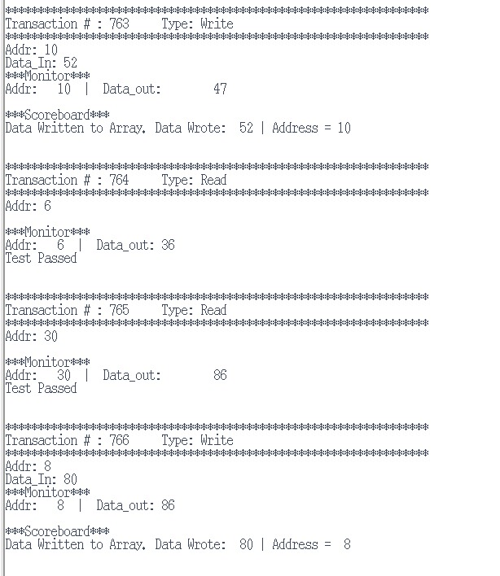
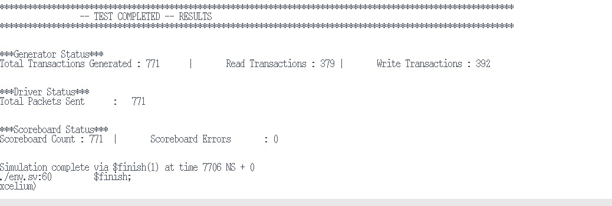

# Lab # 40 - Layered Testbench

## Table of Contents

- [Task – 1: Building Transaction Class](#task--1--building-transaction-class)
- [Task – 2: Creating Generator and Driver Classes](#task--2-creating-generator-and-driver-classes)
  - [Generator Class](#generator-class)
  - [Driver Class](#driver-class)
- [Task – 3: Creating Monitor and Scoreboard Classes](#task--3-creating-monitor-and-scoreboard-classes)
  - [Monitor Class](#monitor-class)
  - [Scoreboard Class](#scoreboard-class)
- [Task – 4: Building the Environment & TB](#task--4-building-the-environment--tb)
  - [Environment Class](#environment-class)
  - [Top Module](#top-module)
- [Test Result](#test-result)

---

## Task – 1: Building Transaction Class

Added memory interface signals as class properties in `transaction` class.  
The modified code for transaction class is in code/task_1/transaction.sv

---

## Task – 2: Creating Generator and Driver Classes

### Generator Class

In `generator` class, created randomized transactions and sent them to the driver and scoreboard using two mailboxes:  
- `gen2drv`  
- `gen2scr`  

Mailboxes work like FIFO queues — one sends transactions to the driver, and the other to the scoreboard.  

`event complete` is used to signal when generation is finished. In the constructor, initialized all handles and set the transaction count.

Inside the `run()` task, the generator creates `count` number of transactions. Each transaction is randomized, sampled for coverage, and then put into both mailboxes.

Also added  `count_w` and `count_r` to keep track of how many write and read transactions are created.

---

### Driver Class

Created `driver` class that takes transactions from the generator using the `gen2drv` mailbox and drives them to the DUT through the virtual interface `vif` and in constructor, connected the mailbox and interface.

The `run()` task runs using a `forever` loop and gets each transaction from the mailbox. waits for the next **negative edge** of the clock, and drives the signals onto the interface.

- If the transaction is a **write**, it sets `write=1`, `read=0`, and sends `addr` and `data_in`.  
- If the transaction is a **read**, it sets `read=1`, `write=0`, and sends only the `addr`.

The driver also tracks how many transactions it has driven using `drv_count`, and prints status for each transaction.

---

## Task – 3: Creating Monitor and Scoreboard Classes

### Monitor Class

The `monitor` class checks the DUT’s  through the virtual interface `vif` and sends the transactions to the scoreboard using the `mon2scr` mailbox.

The `run()` task runs in loop. On every **positive clock edge**, creates a new transaction and captures all signals from the interface, including:

- `read`
- `write`
- `addr`
- `data_in`
- `data_out`

After that it sends this transaction to the scoreboard for comparison with expected data. If the transaction was a **read**, it prints the observed `addr` and `data_out` to help verify DUT response.

---

### Scoreboard Class

The `scoreboard` class checks DUT working correctly by comparing expected and actual transactions.

It gets:

- Expected transactions from the generator via `gen2scr`
- Actual results from the monitor via `mon2scr`

It uses a `golden_model`, which is a associative array to remember all data written to memory.

- If the transaction is a **write**, it stores the `data_in` at the given `addr` in the model.
- If it’s a **read**, it compares the `data_out` from the DUT with the stored value from the model.

If the values match, the test is marked **pass**. If not, it is a **fail**.  
It also counts total checks, passes, and errors.

---

## Task – 4: Building the Environment & TB

### Environment Class

The `env` class connects and runs all parts of the testbench: generator, driver, monitor, and scoreboard. created three mailboxes:

- `gen2drv` → sends transactions from generator to driver  
- `gen2scr` → sends expected transactions to scoreboard  
- `mon2scr` → sends actual results from monitor to scoreboard  

In the constructor, it connects the virtual interface and creates object for all component.

The `test()` task starts all components in parallel using `fork...join_none`.

The `post_test()` task waits for the generator to finish and checks if the driver and scoreboard also completed the same number of transactions.  
At last printed summary report showing:

- Total transactions generated  
- Read/write breakdown  
- Driver packet count  
- Scoreboard results (passes/failures)

The `run()` task simply calls `test()` and `post_test()` to run the full simulation.

---

### Top Module

The `tb` module is the top-level testbench that connects everything.  
It creates a clock signal that toggles every 5 time units.

It then instantiates:
- The interface `bus`, connected to the clock  
- The DUT `mem`, connected to the interface  
- The test environment `env`, which controls the whole simulation

Inside the `initial` block, the environment is created and passed the interface and transaction count.  Then `env.run()` is called to start the simulation.

---

## Test Result

Ran the test by setting count to **771 transactions** on Cadence Xcellium. All transactions passed through the driver, DUT, and scoreboard with **no errors**.

---

## Screenshots

